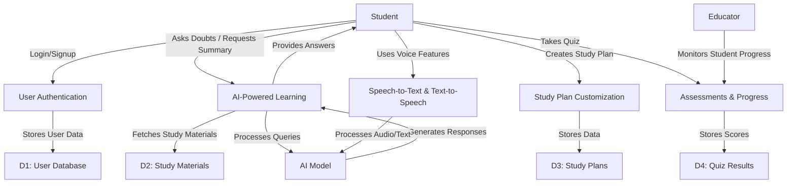
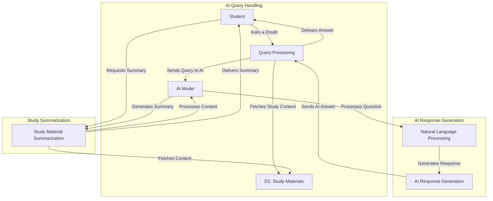

### **Understanding DFD Levels (Data Flow Diagram Levels)**  

A **Data Flow Diagram (DFD)** visually represents how data moves within a system. It consists of **processes, external entities, data stores, and data flows**. DFDs have different levels to show increasing details of the system.

---

### **DFD Levels:**
1. **Level 0 (Context Diagram)** – High-level view of the entire system.
2. **Level 1 (Top-Level DFD)** – Breakdown of major processes in the system.
3. **Level 2 (Detailed DFD)** – Further decomposition of individual processes.

---

### **1. Level 0 DFD (Context Diagram)**
- Represents the entire **AI Study Buddy system** as a single process.
- Shows interactions with **external entities** (Students, Educators, AI Model, Database).
- No internal details of the system.

---

### **2. Level 1 DFD (Top-Level DFD)**
- Breaks the system into **major processes** (e.g., User Authentication, AI-Powered Assistance, Study Plan Customization).
- Shows how data flows between **processes and data stores**.
- Still does not go into deep internal details.

---

### **3. Level 2 DFD (Detailed DFD)**
- Further decomposes each major process from Level 1.
- Shows sub-processes and their data exchanges in detail.
- Provides a more **technical** view of how the system functions.

---

Now, I’ll create the **Mermaid diagrams** for all three levels. Stay tuned! 🚀

### **Level 0 DFD (Context Diagram)**

---
### **Level 1 DFD (Top-Level DFD)**

---
### **Level 2 DFD (Detailed DFD - Breakdown of AI-Powered Learning Assistance)**

---
# Get it converred to svg, png format
- Copy the code using copy button
- paste the code in [https://mermaidchart.com/](https://www.mermaidchart.com/)
- Export the code to svg, png by navigating to the actions section
